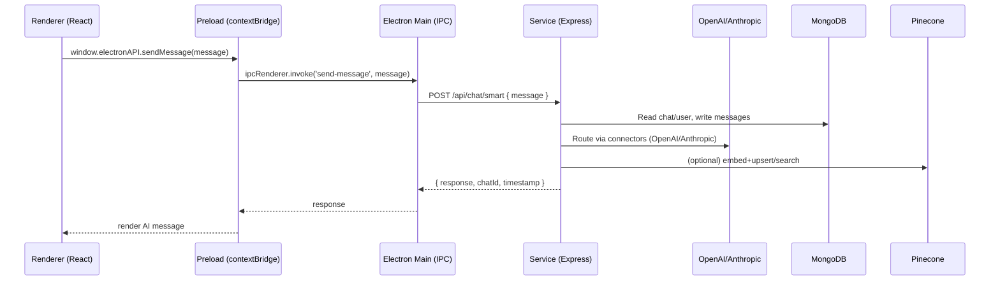

## Proto Super User

An Electron + React desktop application with a TypeScript/Express backend service. It provides a fast chat UI, slash-command palette, semantic search over chats, prompt management/evaluation, and multi-LLM support (OpenAI + Anthropic), with embeddings powered by Pinecone and persistence in MongoDB.


### Monorepo layout

- `.`: Electron app (Vite + React + Tailwind, TypeScript)
- `service/`: Node.js Express service (TypeScript) exposing REST APIs


### Tech stack

- **Frontend**: Electron, Vite, React 18, Tailwind CSS
- **Main/Preload**: esbuild bundling for Electron main/preload
- **Backend**: Express, TypeScript, Helmet, CORS, rate limiting
- **AI/LLM**: OpenAI, Anthropic via LangChain
- **Search/Embeddings**: Pinecone (semantic search over chats)
- **DB**: MongoDB via Mongoose


## Prerequisites

- Node.js ≥ 18 LTS
- npm ≥ 9
- A running MongoDB instance (local or hosted)
- API keys (as needed):
  - OPENAI_API_KEY
  - ANTHROPIC_API_KEY
  - PINECONE_API_KEY


## Setup

1) Install dependencies

```bash
# repo root (Electron app)
npm install

# backend service
cd service
npm install
```

2) Configure environment (backend service)

Create `service/.env` with your local settings:

```bash
# service/.env
PORT=3002
MONGODB_URI=mongodb://localhost:27017/proto-super-user
# Comma-separated origins allowed by CORS
ALLOWED_ORIGINS=http://localhost:5173,http://localhost:3000

# Providers
OPENAI_API_KEY=sk-...
ANTHROPIC_API_KEY=...
PINECONE_API_KEY=...
```

Notes:
- If `MONGODB_URI` is not set, the service defaults to `mongodb://localhost:27017/proto-super-user`.
- Pinecone index defaults to `super-user-chat-history` (see `service/src/connectors/pineconeConnector.ts`).


## Development

Run service and app in separate terminals.

Terminal A (backend service):
```bash
cd service
npm run dev
```

Terminal B (Electron app + renderer):
```bash
npm run dev
```

What `npm run dev` (root) does:
- Starts Vite dev server on port 5173
- Bundles Electron main/preload with esbuild
- Launches Electron with `VITE_DEV_SERVER_URL=http://localhost:5173`

Backend service runs at `http://localhost:3002` by default.


## Build & packaging

Frontend/Electron (from repo root):

```bash
# Production build of renderer + electron-builder package
npm run dist

# Or build only (no installer) then package dir
npm run pack
```

Service (from `service/`):

```bash
cd service
npm run build:prod   # clean + tsc build
npm start            # run dist/index.js
```

Electron packaging outputs to `release/` (see `build.directories.output` in `package.json`).


## Scripts

Root (Electron app):
- `dev`: run Vite + Electron concurrently
- `build`: `build:vite` then `build:electron`
- `build:vite`: Vite production build
- `build:electron`: electron-builder
- `preview`: Vite preview
- `dist`: full build + package (no publish)
- `pack`: build + unpacked dir

Service:
- `dev`: tsx watch on `src/index.ts`
- `build`: tsc
- `build:prod`: clean + build
- `start`: run compiled `dist/index.js`
- `type-check`: `tsc --noEmit`


## Backend API

Base URL: `http://localhost:3002`

- Health
  - `GET /health` → service status
  - `GET /` → service info (available endpoints)

- Users (`/api/users`)
  - `GET /api/users` → list users (supports `?limit=&page=&search=`)
  - `GET /api/users/:userId` → get user
  - `POST /api/users` → create user
  - `PUT /api/users/:userId` → update user
  - `DELETE /api/users/:userId` → delete user

- Chats (`/api/chats`)
  - `GET /api/chats` → list chats (optional `user_id`, `limit`, `page`)
  - `GET /api/chats/:chatId` → get chat
  - `POST /api/chats` → create chat
  - `POST /api/chats/:chatId/messages` → add message
  - `PUT /api/chats/:chatId` → update chat (e.g., model)
  - `DELETE /api/chats/:chatId` → delete chat
  - `GET /api/chats/user/:userId` → chats by user
  - `GET /api/chats/:chatId/history` → get history
  - `DELETE /api/chats/:chatId/history` → clear history

- Models (`/api/models`)
  - `GET /api/models/openai` → union of OpenAI + Anthropic model ids

- Prompts (`/api/prompts`)
  - `GET /api/prompts` → list prompts
  - `GET /api/prompts/echo` → test endpoint (extract + persist prompt)
  - `GET /api/prompts/eval?chatId=...` → evaluate a prompt for a chat
  - `POST /api/prompts/eval-batch` → evaluate across multiple chats

- Smart Chat (`/api/chat`)
  - `POST /api/chat` → legacy chat with history
  - `POST /api/chat/smart` → routed chat
    - Body:
      ```json
      {
        "message": {
          "userId": "uuid",
          "newChat": true,
          "modelName": "gpt-4o-mini",
          "text": "Hello world",
          "chatId": "optional-existing-chat-id"
        }
      }
      ```
  - `POST /api/chat/memory` → return chat summary (example flow)
  - `GET  /api/chat/run-embedding` → index all chats for semantic search

- Search (`/api/search`)
  - `POST /api/search/semantic` → body `{ query, userId?, chatId?, topK?, minSimilarity? }`
  - `POST /api/search/conversations` → `{ query, userId?, topK? }`
  - `POST /api/search/context` → `{ query, userId, currentChatId?, contextSize? }`
  - `POST /api/search/index-chat/:chatId` → index single chat history

- OCR (`/api/ocr`)
  - `POST /api/ocr` → placeholder response `{ "message": "Stream, hello world" }`


### Example requests

Users: list with pagination
```bash
curl -s "http://localhost:3002/api/users?limit=10&page=1"
```

Smart chat (routed)
```bash
curl -s -X POST "http://localhost:3002/api/chat/smart" \
  -H "Content-Type: application/json" \
  -d '{"message":{"userId":"77727f75-2cc7-4e77-8f39-ad384ec784e2","newChat":true,"modelName":"gpt-4o-mini","text":"Hello!"}}'
```

Semantic search
```bash
curl -s -X POST "http://localhost:3002/api/search/semantic" \
  -H "Content-Type: application/json" \
  -d '{"query":"reset password email","userId":"77727f75-2cc7-4e77-8f39-ad384ec784e2"}'
```


## Frontend usage highlights

- Chat input supports a slash-command menu (`/`) with:
  - **Modes** (choose model)
  - **Prompts** (template insertion; variable editor when needed)
  - **Search** (semantic, conversation, context)
  - **Stream** (toggle streaming UI mode)
- Status bubbles and loading indicator while AI is responding.


## Troubleshooting

- Missing API keys
  - OpenAI/Anthropic/Pinecone connectors will throw if keys are not set.
  - Ensure `service/.env` is loaded (restart dev server after changes).

- MongoDB connection
  - Verify `MONGODB_URI` and that MongoDB is reachable.
  - Check logs for connection/retry messages.

- CORS errors during web preview
  - Update `ALLOWED_ORIGINS` in `service/.env` to include your origin(s).

- Electron dev startup
  - Port 5173 must be free; `npm run dev` waits for Vite before launching.
  - If UI says “Electron API not available”, fully restart the Electron app.


## Architecture

### High-level overview

- Electron (Main, Preload, Renderer) is the desktop shell and UI.
- Backend service (`service/`) is a separately run Express API for data, LLM routing, and search.
- External providers: OpenAI and Anthropic via LangChain; Pinecone for vector search; MongoDB for persistence.

Data flow (simplified):



### Components and responsibilities

- Electron Main (`src/main/main.ts`)
  - Creates windows (main, quick chat, command palette)
  - Registers IPC handlers: `send-message`, `get-openai-models`, `get-prompts`
  - Loads Preload with `contextIsolation: true`, `nodeIntegration: false`
  - Note: avoid placing secrets here; access the backend service instead

- Preload (`src/preload/preload.ts`)
  - Exposes a narrow, typed `electronAPI` surface via `contextBridge`
  - Mediates all renderer-to-main communication (IPC)

- Renderer (React, e.g., `src/renderer/components/chatWindow.tsx`)
  - Chat UI, slash-command palette, search modes
  - Calls `window.electronAPI.*` (never direct Node APIs)

- Service (Express, `service/src/index.ts`)
  - Security: Helmet, CORS (configurable), IP rate limiting, centralized error handler, request logging
  - Composition: `ServiceContainer`/`ServiceRegistry` for DI-style service wiring
  - Routes mounted in `routes/api.ts`: `users`, `chats`, `models`, `prompts`, `chat` (smart), `search`, `ocr`
  - Connectors: OpenAI (`OpenAIConnector`), Anthropic (`AntropicConnector`), Pinecone (`PineconeConnector`)
  - Search: Embedding/index with Pinecone; semantic and conversation context endpoints

### Data model (MongoDB via Mongoose)

- `User` (`user_id`, `user_name`, `user_email`, timestamps)
- `Chat` (`chat_id`, `user_id`, `model_name`, `chat_history[{role, content, timestamp}]`, timestamps)
- `Prompt` (`prompt_id`, `user_id`, `prompt_name`, `prompt_description`, `prompt_content`, `model_name`, timestamps)

All models index common access paths for performance (e.g., `user_id`, `chat_id`, `prompt_id`).

### Security and reliability

- Helmet hardens HTTP headers; CORS restricts origins via `ALLOWED_ORIGINS`
- Rate limiting protects APIs (`express-rate-limit`)
- Central error handler hides stack traces in production
- Connectors apply request timeouts and surface provider-specific errors
- No secrets in the renderer; keys loaded from `service/.env`

### Operational concerns

- Health endpoint: `GET /health`
- Structured logging: `middleware/logger.ts` instruments basic request timing
- Graceful shutdown: DB close and service container shutdown on SIGINT/SIGTERM
- Index management: Pinecone index auto-created if missing (ensure IAM/key scope)

### Design notes and recommendations

- Avoid duplicate local Express servers: Electron Main currently starts an Express app on port `3002` and also calls `http://localhost:3002` for backend. To prevent port conflicts and recursion:
  - Prefer running the backend service separately (recommended) and remove the Express server from Electron Main; or
  - Use a distinct proxy port in Electron (e.g., `3003`) and set `BACKEND_URL` to the external service URL.
- Centralize configuration:
  - Introduce a single `SERVICE_BASE_URL` env for Electron Main IPC to reach the backend
  - Keep provider keys strictly in `service/.env`
- Input validation:
  - Add request schema validation (e.g., Zod/express middleware) on all write endpoints
- Observability:
  - Add request IDs and structured logs (pino/winston), emit timing/usage metrics
  - Consider OpenAPI/Swagger for API documentation and contract tests
- Performance:
  - Optional: streaming responses (SSE/WebSocket) for token-by-token UI updates
  - Add batching/throttling for embedding jobs and background workers
- Testing:
  - Unit tests for services/connectors, e2e tests for routes, and renderer component tests
- Security:
  - Set `trust proxy` if behind a proxy before rate limit
  - Add auth if user-specific data becomes sensitive (JWT/session, CSRF where relevant)


## Security notes

- Do not commit real secrets. `.gitignore` excludes `.env` files by default; keep example configs in `*.example` files.


## License

MIT
